# Paper Daily: 3D Representation

## DMTeT

1. Deformable Tetrahedral Grid(DTG)
2. Volume Subdivision(VS)
3. Marching Tetrahedra(MT)
4. Neural Network(NN) Structure

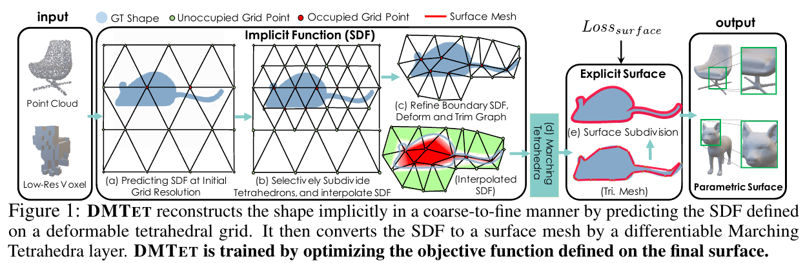

1. DTG

* Deformable Tetrahedral Grid: 

$$ (V_T,T). $$

* Tetrahedra:

$$ T_k = \{v_{ak}, v_{bk}, v_{ck}, v_{dk}\}, T_k \in T, k\in\{1,2,...,K\},v_{ik}\in V_T.$$ 

* SDF value stored on vertices:

$$ s(v_i), v_i \in V_T. $$

* SDF value else where: $s(v)$ follows a barycentric interpolation.

2. VS

* Determine the surface tetrahedra $T_{surf}$: checking whether there are vertices in different SDF signs.

* Subdivide $T_{surf}$ for higher resolution:

$$v_{ac} = \frac{1}{2}(v_a+v_c),$$
$$s(v_{ac)} = \frac{1}{2}(s(v_a)+s(v_c)).$$

3. MT

* Define typology inside each grid depending on the signs of SDF values on its vertices.

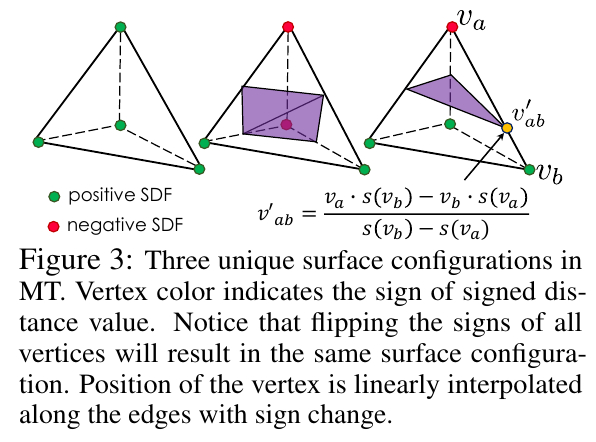

* Determine locations of vertices: $s(v) = 0$

$$ v_{ab} = \frac{v_a \cdot s(v_b) - v_b \cdot s(v_a)}{s(v_b) - s(v_a)}.$$

4. NN Structure

* $v_i, \alpha_i$ are all learnable parameters

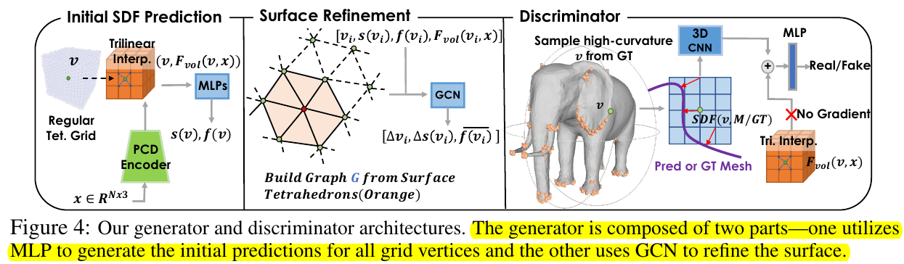

## 3D Gaussian Splatting

# Paper Daily: Score-based Generative Models

## SMLD

1. Score Matching for score estimation
2. Sampling with Langevin dynamics
3. Challenges of score-based generative modeling
4. Noise conditional score networks(NCSN) 

Score matching with Langevin dynamics.

Suppose our datset consists of i.i.d. samples $\{x_i \in \mathbb{R}^D\}_{i=1}^N$ from an unknown data distribution $p_{data}(x)$. 

1. Score Matching for score estimation

* Score of a probability density $p(x)$ :

$$\nabla_x \log p(x).$$

* Score network to approximate the score of $p_{data}(x)$:

$$s_\theta: \mathbb{R}^D \to \mathbb{R}^D.$$

* Minimize objective:

$$\frac{1}{2}\mathbb{E}_{p_{data}(x)}\left[\|s_\theta(x)-\nabla_x\log p_{data}(x)\|_2^2\right]$$

$$\Leftrightarrow$$

$$\mathbb{E}_{p_{data}(x)}\left[tr(\nabla_xs_\theta(x)) + \frac{1}{2}\|s_\theta(x)\|_2^2\right]+const,$$

under $s_\theta{x}$ is differentiable, $p_{data}(x)$ is differentiable, $\mathbb{E}\left[\|s_\theta(x)\|^2 \right]$ and $\mathbb{E}\left[\|\nabla_x\log p_{data}(x)\|^2 \right]$ are finite for any $\theta$, $p_{data}(x)s_\theta(x)$ goes to 0 for any $\theta$ when $\|x\| \to \infty$,where $\nabla_xs_\theta(x)$ denotes the Jacobian of $s_\theta(x)$.

Proof:

First, rewrite the original objective as:

$$J(\theta) = \int p_{data}(x) \left[\frac{1}{2}\|\nabla_x\log p_{data}(x)\|^2 + \frac{1}{2}\|s_\theta(x)\|^2 - \nabla_x\log p_{data}(x)^T s_\theta(x)\right]dx,$$

where we can ignore the $\frac{1}{2}\|\nabla_x\log p_{data}(x)\|^2$ part since it is unrelated with $\theta$ and it will be a constant. The integral of $\frac{1}{2}\|s_\theta(x)\|^2$ is exactly equal to $\mathbb{E}_{p_{data}(x)}\left[\frac{1}{2}\|s_\theta(x)\|^2\right]$. So all we need to prove is:

$$\int p_{data}(x) \left[- \nabla_x\log p_{data}(x)^T s_\theta(x)\right]dx = \int p_{data}(x) \left[tr(\nabla_xs_\theta(x))\right]dx,$$

i.e,

$$\int p_{data}(x) \left[- \nabla_x\log p_{data}(x)^T s_\theta(x)\right]dx = \int p_{data}(x) \left[\Sigma_{i=1}^N \frac{\partial s_\theta(x)_i}{\partial x_i}\right]dx.$$

To further prove this part, we first examine:

$$\int p_{data}(x) \left[- \nabla_x\log p_{data}(x)^T s_\theta(x)\right]dx = -\Sigma_{i=1}^N \int p_{data}(x) \nabla_{x_i}\log p_{data}(x) s_\theta(x)_i dx,$$

where we consider each $i$ seperately applying chain rule:

$$-\int p_{data}(x) \frac{\partial\log p_{data}(x)}{\partial x_i} s_\theta(x)_i dx = -\int p_{data}(x)\frac{1}{p_{data}(x)}\frac{\partial p_{data}(x)}{\partial x_i} s_\theta(x)_i dx, $$

$$= -\int \frac{\partial p_{data}(x)}{\partial x_i} s_\theta(x)_i dx.$$

To further prove the equation, we would like to introduce the lemma below:

$$\lim_{a \to \infty, b \to -\infty} f(a,x_2,\dots,x_n)g(a,x_2,\dots,x_n) - f(b,x_2,\dots,x_n)g(b,x_2,\dots,x_n),$$

$$=\int_{-\infty}^{\infty} f(x)\frac{\partial g(x)}{\partial x_1}dx_1 + \int_{-\infty}^{\infty} g(x)\frac{\partial f(x)}{\partial x_1}dx_1,$$

which is obvious when you regard $x_1$ as the only variable of the functions and other variables remain fixed. The only thing you need to do is to integrate over $x_1 \in \mathbb{R}$:

$$\frac{\partial f(x)g(x)}{\partial x_1} = f(x)\frac{\partial g(x)}{\partial x_1} + g(x)\frac{\partial f(x)}{\partial x_1}.$$

With this lemma, we can rewrite $-\int \frac{\partial p_{data}(x)}{\partial x_1} s_\theta(x)_1 dx$ as:

$$-\int \frac{\partial p_{data}(x)}{\partial x_1} s_\theta(x)_1 dx = -\int \left[ \int \frac{\partial p_{data}(x)}{\partial x_1} s_\theta(x)_1 dx_1 \right] d(x_2,\dots,x_n),$$

$$= -\int \left[\lim_{a \to \infty, b \to -\infty}\left[ p_{data}(a,x_2,\dots,x_n)s_\theta(a,x_2,\dots,x_n)_1 - p_{data}(b,x_2,\dots,x_n)s_\theta(b,x_2,\dots,x_n)_1\right]\right]$$

$$d(x_2,\dots,x_n)$$

$$+\int\int \frac{\partial s_\theta(x)_1}{\partial x_1} p_{data}(x) dx_1 d(x_2,\dots,x_n).$$

Since we assume that $p_{data}(x)s_\theta(x)$ goes to 0 for any $\theta$ when $\|x\| \to \infty$, then:

$$-\int \frac{\partial p_{data}(x)}{\partial x_1} s_\theta(x)_1 dx = \int \frac{\partial s_\theta(x)_1}{\partial x_1} p_{data}(x) dx,$$

and we finished the proof.

However, score matching is expensive since we need to compute and backpropagate $tr(\nabla_xs_\theta(x))$, where $x$ is a high-dimensional data.

* Denoising score matching:

Denoising score matching is a variant of score matching that
completely circumvents $tr(\nabla_xs_\theta(x))$.

Recall the minimize objective:

$$\frac{1}{2}\mathbb{E}_{p_{data}(x)}\left[\|s_\theta(x)-\nabla_x\log p_{data}(x)\|_2^2\right].$$

The problem is, we can not acquire an explicit representation of $p_{data}(x)$. To fix this, we may use a Parzen windows density estimator $q_{\sigma}(\widetilde{x})$.

The Parzen window density estimator is a non-parametric method used for estimating the probability density function (PDF) of a random variable. It is particularly useful when the underlying distribution is not known or when the data is limited. The Parzen window approach is based on the idea of placing a window (or kernel) around each data point and using these windows to estimate the overall density.

Here's a brief overview of how the Parzen window density estimator works(in 1D case):

First it needs to choose a window/kernel function. A kernel function should be symmetric and integrate to one. A general example is a Gaussian kernel:

$$K(u) = \frac{1}{\sqrt{2\pi}}\exp\{-\frac{1}{2}u^2\}.$$

For each data point $x_i$​, a window is centered at that point. The choice of the window width, often denoted as $h$ (bandwidth), determines the smoothness of the estimated density. A larger bandwidth results in a smoother estimate, but it might oversmooth the density and lose fine details. Conversely, a smaller bandwidth captures more details but may be sensitive to noise.

The density estimate $q_{\sigma}(\widetilde{x})$ at a point $\widetilde{x}$ is obtained by summing up the contributions of all data points, each scaled by the kernel function and the window width $\sigma$:

$$q_{\sigma}(\widetilde{x})=\frac{1}{n\sigma}\Sigma_{i=1}^n  K(\frac{\widetilde{x}-x_i}{\sigma}).$$

The Parzen window estimator is sensitive to the choice of the kernel function and bandwidth. Cross-validation or other methods can be used to select an optimal bandwidth for a given dataset.

While the Parzen window estimator is simple and intuitive, it may not perform well in high-dimensional spaces due to the "curse of dimensionality." Other techniques like kernel density estimation with different bandwidth selection methods or more advanced density estimation methods (e.g., mixture models) might be considered for such cases.

So we replace $p_{data}(x)$ with $q_{\sigma}(\widetilde{x})$ in the objective above.

In this case, we get a new objective along with its equivalent form:

$$\frac{1}{2}\mathbb{E}_{q_{\sigma}(\widetilde{x})}\left[\|s_\theta(\widetilde{x})-\nabla_\widetilde{x}\log q_{\sigma}(\widetilde{x})\|_2^2\right]$$

$$\Leftrightarrow$$

$$\frac{1}{2}\mathbb{E}_{q_{\sigma}(\widetilde{x}|x)p_{data}(x)}\left[\|s_\theta(\widetilde{x})-\nabla_\widetilde{x}\log q_{\sigma}(\widetilde{x}|x)\|_2^2\right]+const,$$

where the perturbed data distribution $q_{\sigma}(\widetilde{x})=\int q_{\sigma}(\widetilde{x}|x) p_{data}(x)dx$.

Proof:

First we rewrite the objective as:

$$\frac{1}{2}\mathbb{E}_{q_{\sigma}(\widetilde{x})}\left[\|s_\theta(\widetilde{x})-\nabla_\widetilde{x}\log q_{\sigma}(\widetilde{x})\|_2^2\right],$$

$$=\frac{1}{2}\int(\|s_\theta(\widetilde{x})-\nabla_\widetilde{x}\log q_{\sigma}(\widetilde{x})\|_2^2)q_{\sigma}(\widetilde{x})d\widetilde{x},$$

$$=\frac{1}{2}\int(\|s_\theta(\widetilde{x})\|_2^2 + \|\nabla_\widetilde{x}\log q_{\sigma}(\widetilde{x})\|_2^2)q_{\sigma}(\widetilde{x})d\widetilde{x} -\int\langle s_\theta(\widetilde{x}), \nabla_\widetilde{x}\log q_{\sigma}(\widetilde{x})\rangle q_{\sigma}(\widetilde{x})d\widetilde{x}.$$

Take a closer examine to the last term:

$$\int\langle s_\theta(\widetilde{x}), \nabla_\widetilde{x}\log q_{\sigma}(\widetilde{x})\rangle q_{\sigma}(\widetilde{x})d\widetilde{x},$$

$$=\int\langle s_\theta(\widetilde{x}), \frac{1}{q_{\sigma}(\widetilde{x})}\nabla_\widetilde{x}q_{\sigma}(\widetilde{x})\rangle q_{\sigma}(\widetilde{x})d\widetilde{x},$$

$$=\int\langle s_\theta(\widetilde{x}), \nabla_\widetilde{x}q_{\sigma}(\widetilde{x})\rangle d\widetilde{x},$$

$$=\int\langle s_\theta(\widetilde{x}), \nabla_\widetilde{x}\int q_{\sigma}(\widetilde{x}|x) p_{data}(x)dx\rangle d\widetilde{x},$$

$$=\int\langle s_\theta(\widetilde{x}), \int \nabla_\widetilde{x}q_{\sigma}(\widetilde{x}|x) p_{data}(x)dx\rangle d\widetilde{x},$$

$$=\int\int\langle s_\theta(\widetilde{x}), \nabla_\widetilde{x}q_{\sigma}(\widetilde{x}|x) p_{data}(x)\rangle dxd\widetilde{x},$$

$$=\int\int\langle s_\theta(\widetilde{x}), q_{\sigma}(\widetilde{x}|x)\nabla_\widetilde{x}\log q_{\sigma}(\widetilde{x}|x) p_{data}(x)\rangle dxd\widetilde{x},$$

$$=\int\int\langle s_\theta(\widetilde{x}), \nabla_\widetilde{x}\log q_{\sigma}(\widetilde{x}|x) \rangle q_{\sigma}(\widetilde{x}|x)p_{data}(x)dxd\widetilde{x}.$$

Then, we put this term back to the objective:

$$=\frac{1}{2}\int(\|s_\theta(\widetilde{x})\|_2^2 + \|\nabla_\widetilde{x}\log q_{\sigma}(\widetilde{x})\|_2^2)q_{\sigma}(\widetilde{x})d\widetilde{x} -\int\langle s_\theta(\widetilde{x}), \nabla_\widetilde{x}\log q_{\sigma}(\widetilde{x})\rangle q_{\sigma}(\widetilde{x})d\widetilde{x},$$

$$=\frac{1}{2}\int\int(\|s_\theta(\widetilde{x})\|_2^2)q_{\sigma}(\widetilde{x}|x)p_{data}(x)dxd\widetilde{x}$$

$$-\int\int\langle s_\theta(\widetilde{x}), \nabla_\widetilde{x}\log q_{\sigma}(\widetilde{x}|x) \rangle q_{\sigma}(\widetilde{x}|x)p_{data}(x)dxd\widetilde{x}+const,$$

$$=\frac{1}{2}\mathbb{E}_{q_{\sigma}(\widetilde{x}|x)p_{data}(x)}\left[\|s_\theta(\widetilde{x})-\nabla_\widetilde{x}\log q_{\sigma}(\widetilde{x}|x)\|_2^2\right]+const.$$

And we finished the prove.

The underlying intuition is that following the gradient of the log density at some corrupted point $\widetilde{x}$ should ideally move us towards the clean sample $x$. We can prove this by writing the explicit expression of $\nabla_{\widetilde{x}}\log q_\sigma(\widetilde{x}|x)$ when $K$ is a gaussian kernel.

$$\nabla_{\widetilde{x}}\log q_\sigma(\widetilde{x}|x) = \nabla_{\widetilde{x}}\log (\frac{1}{\sqrt{2\pi}\sigma}\exp\{-\frac{1}{2}\frac{(\widetilde{x}-x)^2}{\sigma^2}\})= \frac{x-\widetilde{x}}{\sigma^2}.$$

However, although $s_{\theta^*}(\widetilde{x})=\nabla_\widetilde{x}\log q_{\sigma}(\widetilde{x})$ (where ${\theta^*}=argmin_{\theta}(\frac{1}{2}\mathbb{E}_{q_{\sigma}(\widetilde{x}|x)p_{data}(x)}\left[\|s_\theta(\widetilde{x})-\nabla_\widetilde{x}\log q_{\sigma}(\widetilde{x}|x)\|_2^2\right])$) almost  surely, $\sigma$ has to be small enough to make the approximation $p_{data}(x)\approx q_{\sigma}(\widetilde{x})$ come true. Thus making it impossible to directly sample from a simple distribution like standard gaussian(if $\sigma$ can be large enough, $q_{\sigma}(\widetilde{x})$ will approximate to some simple distribution like gaussian).

* Sliced score matching:

Sliced score matching uses random projections to approximate
$tr(\nabla_{\theta}s_{\theta}(x))$ in score matching. The idea is to transform high dimensional problems to one dimensional problems. Inspired by __Sliced Wasserstein distance__, we consider projecting $\nabla_x \log p_{data}(x)$ and $s_\theta(x)$ onto some random direction $v$ and propose to compare their average difference along that random direction.

The objective will be:

$$\frac{1}{2}\mathbb{E}_{v\textasciitilde p(v),x\textasciitilde p_{data}(x)}\left[(v^Ts_\theta(x)-v^T\nabla_x \log p_{data}(x))^2\right]$$

$$\Leftrightarrow$$

$$\mathbb{E}_{v\textasciitilde p(v),x\textasciitilde p_{data}(x)}\left[v^T\nabla_x s_\theta(x)v + \frac{1}{2}\|s_\theta(x)\|_2^2\right],$$

where $p(v)$ is a simple distribution of random vectors, for instance, the multivariate standard normal. And $v^T\nabla_x s_\theta(x)v$ can be efficiently computed by forward mode auto-differentiation.

However, it will spend much time in forward mode auto-differentiation.

:hammer: :wrench:

2. Sampling with Langevin dynamics

Langevin dynamics can produce samples from a probability density p(x) using only the score function $\nabla_x \log p_{data}(x)$. 

*  Stochastic optimization:

Stochastic optimization is a method to find maximum likelihood(ML) or maximum a posteriori(MAP) parameters $\theta^*$. 

Let $\theta$ denote a parameter vector, with $p(\theta)$ a prior distribution, and $p(x|\theta)$ the likelihood given our model parmeterized by $\theta$. The posterior distribution of a set of $N$ data items $X = \{x_i\}_{i=1}^N$ is: $p(\theta|X) \propto p(\theta)\Pi_{i=1}^N p(x_i|\theta)$. 

What we gonna do is: find the gradient of the logarithm posterior function, and backpropogate to do gradient accent.

First we write the gradient of the logarithm posterior function in general case:

$$\nabla_\theta \log p(\theta) + \Sigma_{i=1}^N \nabla_\theta \log p(x_i|\theta).$$

However, this requires to go through the whole dataset which is computational costly. So instead we use a subset of $n$ data items $X_t = \{x_{t1},\dots,x_{tn}\}$ is given, and in this case the parameter are updated as follows:

$$\Delta \theta_t = \frac{\epsilon_t}{2}(\nabla_{\theta_t} \log p(\theta_t) + \frac{N}{n} \Sigma_{i=1}^n \nabla_{\theta_t} \log p(x_i|\theta_t)),$$

where you may regard $\epsilon_t$ as a sequence of step sizes (similar with learning rate). The intuition is that we use the average gradient of the subset to represent the overall gradient of the whole dataset. To ensure convergence, you should also ensure:

$$\Sigma_{t=1}^T \epsilon_t = \infty, \Sigma_{t=1}^T \epsilon_t^2 < \infty,$$

where the first constraint ensures that the parameters will reach the high probability regions anyway no matter how far away it was initialized to. And the second ensures that the parameters will converge instead of bouncing around the target. Typically, we may have:

$$\epsilon_t = a(b+t)^{-\gamma},$$

where it decayed polynomially with $\gamma \in (0.5,1]$. 

However, the problem is, this method did not take parameter uncertainty into account and can potentially overfit data.

* Stochastic gradient with Langevin dynamics:

$$\Delta \theta_t = \frac{\epsilon_t}{2}(\nabla_{\theta_t} \log p(\theta_t) + \frac{N}{n} \Sigma_{i=1}^n \nabla_{\theta_t} \log p(x_i|\theta_t)) + \eta_t,$$

$$\eta_t \textasciitilde \mathcal{N}(0, \sqrt{\epsilon_t}^2).$$

In our scenario, we will apply this to $\widetilde{x}_0$. Given a fixed step size $\epsilon > 0$, and $\widetilde{x}_0 \textasciitilde \pi(x)$ where $\pi$ is the prior distribution, we can sample recursively using:

$$\widetilde{x}_t = \widetilde{x}_{t-1} + \frac{\epsilon}{2}\nabla_x \log p(\widetilde{x}_{t-1}) + \sqrt{\epsilon}z_t,$$

where $z_t\textasciitilde\mathcal{N}(0,I)$. The distribution of $\widetilde{x}_T$ equals $p(x)$ when $\epsilon \to 0$ and $T \to \infty$, and we can get an exact sample from $p(x)$. Note that such sampling method only requires a score function $\nabla_x \log p(x)$. Therefore, we replace it with our trained score network $s_\theta(x) \approx \nabla_x \log p(x)$ in Langevin dynamics. Then we get our final sampling result.

:hammer: :wrench:

3. Challenges of score-based generative modeling

* Manifold hypothesis:

Manifold hypothesis is that the data in the real world tend to concentrate on low dimensional manifolds embedded in a high dimensional space(for instance, the ambient space). 

Under this hypothesis, the score-based generative model will face 2 difficulties.

First, the score is a graident taken in ambient space. So it won't be as effective as directly modeling on the low dimensional manifold. In many case, the gradient is "undefined". Second, the score matching objective procides a consistent score estimator only when the support of the data distribuion of the data distribution is the whole space.

So in order to address these problems, we find that perturbing the data with a small Guassian noise, the loss will converge. This is because the support of the Gaussian noise distribution is in the whole space. So our data will not be confined on a low dimensional manifold, and we obviates difficulties from the manifolf hypothesis and well-defined score estimation.

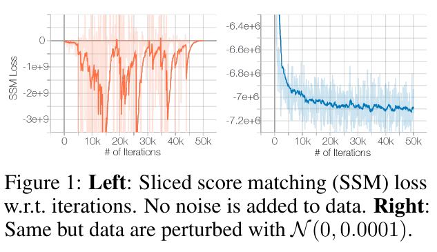

* Low-density regions:

Regions of low data density means that there's not enough evidence in this region to estimate score functions accurately. In practice, the expectation in the objective is simulated with i.i.d. samples $\{x_i\}_{i=1}^N \textasciitilde (i.i.d.) p_{data}(x)$. Consider any region $\mathcal{R}\subset\mathbb{R}^D$ such that $p_{data}(x)$. In most cases $\{x_i\}_{i=1}^N  \cap \mathcal{R} = \emptyset$, and score matching will not have sufficient data samples to estimate the score accurately for $x\in \mathcal{R}$.

Also, consider a mixture distribution $p_{data}(x) = \pi p_1(x) + (1-\pi)p_2(x)$, where $p_1$ and $p_2$ are normalized distributions with disjoint supports, and $\pi \in (0,1)$. In the support of $p_1(x)$, $\nabla_x \log p_{data}(x) = \nabla_x \log p_1(x)$. And in the support of $p_2(x)$, $\nabla_x \log p_{data}(x) = \nabla_x \log p_2(x)$. The sampling with Langevin dynamics in this case will not depend on $\pi$. We can approximate a data distribution with low density regions with a disjoint normalized distribution. This will require a very small step size and a very large number of steps to mix.

We observed that samples from Langevin dynamics have incorrect relative density between the two modes. The solution to this is to use annealed Langevin dynamics as stated in the next section.

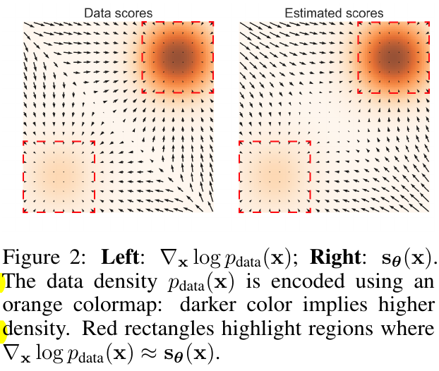

4. NCSN

Consider the flaws above, noise conditional score-based network is proposed.

We observe that perturbing data with random Gaussian noise makes the data distribution more amenable to score-based generative modeling. First, since the support of our Gaussian noise distribution is the whole space, the perturbed data will not be confined to a low dimensional manifold, which obviates difficulties from the manifold hypothesis and makes score estimation well-defined. Second, large Gaussian noise has the effect of filling low density regions in the original unperturbed data distribution; therefore score matching may get more training signal to improve score estimation. Furthermore, by using multiple noise levels we can obtain a sequence of noise-perturbed distributions
that converge to the true data distribution. We can improve the mixing rate of Langevin dynamics on multimodal distributions by leveraging these intermediate distributions in the spirit of simulated annealing and annealed importance sampling.

* NCSN structure:

Let $\{\sigma_i\}_{i=1}^L$ be a positive geometric sequence that satisfies $\frac{\sigma_1}{\sigma_2} = \dots = \frac{\sigma_{L-1}}{\sigma_L} > 1$. Let $q_{\sigma}(x) = \int p_{data}(t)\mathcal{N}(x|t,\sigma^2I)dt$ denote the perturbed data distribution. We choose the noise levels $\{\sigma_i\}_{i=1}^L$ such that $\sigma_1$ is large enough to mitigate the difficulties mentioned above and $\sigma_L$ is small enough to minimize the effect on data. We aim to train a conditional score network to jointly estimate the scores of all perturbed data distributions, $\forall\sigma \in \{\sigma_i\}_{i=1}^L : s_\theta(x,\sigma) \approx \nabla_x \log q_\sigma(x)$.

* Training score matching:

Choose the noise distribution to be $q_\sigma(\widetilde{x}|x) = \mathcal{N}(\widetilde{x}|x, \sigma^2I)$. We can get its score function: $\nabla_\widetilde{x}\log q_\sigma(\widetilde{x}|x) = \frac{x-\widetilde{x}}{\sigma^2}$.

$$\mathcal{l}(\theta;\sigma) = \frac{1}{2}\mathbb{E}_{p_{data}(x)}\mathbb{E}_{\widetilde{x}\textasciitilde\mathcal{N}(x,\sigma^2I)}\left[\|s_\theta(\widetilde{x},\sigma) + \frac{x-\widetilde{x}}{\sigma^2}\|_2^2\right].$$

Then, we combine the objective on different noise levels to one unified objective:

$$\mathcal{L}(\theta;\{\sigma_i\}_{i=1}^L) = \frac{1}{L}\Sigma_{i=1}^L \lambda(\sigma_i)\mathcal{l}(\theta;\sigma_i),$$

where $\lambda(\sigma_i)>0$ is a coefficient function depending on $\sigma_i$. 

The reason we need $\lambda(\sigma_i)$ is that we want the values of $\lambda(\sigma_i)\mathcal{l}(\theta;\sigma_i)$ for all $\{\sigma_i\}_{i=1}^L$ are roughly of the same order of magnitude. 

Choose $\lambda(\sigma) = \sigma^2$ with $\|s_\theta(x,\sigma)\|_2 \propto \frac{1}{\sigma}$. Since we under this choice, we have $\lambda(\sigma) \mathcal{l}(\theta;\sigma) = \sigma^2\mathcal{l}(\theta;\sigma) = \frac{1}{2}\mathbb{E}\left[\|\sigma s_\theta(\widetilde{x},\sigma)+\frac{\widetilde{x}-x}{\sigma}\|_2^2\right]$. Since $\frac{\widetilde{x}-x}{\sigma} \textasciitilde\mathcal{N}(0,I)$ and $\|\sigma s_\theta(x, \sigma)\|_2 \propto 1$, we can easily conclude that the order of magnitude of $\lambda(\sigma) \mathcal{l}(\theta;\sigma)$ does not depend on $\sigma$.

* Inferencing via annealed Langevin dynamics:

In order to fully understand the idea of NCSN inference, we will recall denoising score matching.

$$\frac{1}{2}\mathbb{E}_{q_{\sigma}(\widetilde{x})}\left[\|s_\theta(\widetilde{x})-\nabla_\widetilde{x}\log q_{\sigma}(\widetilde{x})\|_2^2\right]$$

$$\Leftrightarrow$$

$$\frac{1}{2}\mathbb{E}_{q_{\sigma}(\widetilde{x}|x)p_{data}(x)}\left[\|s_\theta(\widetilde{x})-\nabla_\widetilde{x}\log q_{\sigma}(\widetilde{x}|x)\|_2^2\right]+const,$$

where the perturbed data distribution $q_{\sigma}(\widetilde{x})=\int q_{\sigma}(\widetilde{x}|x) p_{data}(x)dx$.

However, remember that although $s_{\theta^*}(\widetilde{x})=\nabla_\widetilde{x}\log q_{\sigma}(\widetilde{x})$ (where ${\theta^*}=argmin_{\theta}(\frac{1}{2}\mathbb{E}_{q_{\sigma}(\widetilde{x}|x)p_{data}(x)}\left[\|s_\theta(\widetilde{x})-\nabla_\widetilde{x}\log q_{\sigma}(\widetilde{x}|x)\|_2^2\right])$) almost  surely, $\sigma$ has to be small enough to make the approximation $p_{data}(x)\approx q_{\sigma}(\widetilde{x})$ come true. Thus making it impossible to directly sample from a simple distribution like standard gaussian(if $\sigma$ can be large enough, $q_{\sigma}(\widetilde{x})$ will approximate to some simple distribution like gaussian).

So what we are doing in NCSN is: we initialize a white noise(a standard gaussian) for updating, and we train a series of score network for different noise level $\sigma$. And start from the white noise, we first use the score network of largest noise level $\sigma_1$. By using this to update the white noise along with Langevin dynamics, we will intuitively reach a region where noise level is decreased. Since: 

$$\nabla_{\widetilde{x}}\log q_\sigma(\widetilde{x}|x) = \nabla_{\widetilde{x}}\log (\frac{1}{\sqrt{2\pi}\sigma}\exp\{-\frac{1}{2}\frac{(\widetilde{x}-x)^2}{\sigma^2}\})= \frac{x-\widetilde{x}}{\sigma^2}.$$

Since the approximation $p_{data}(x)\approx q_{\sigma}(\widetilde{x})$, so it will only be slightly recovered. Then we may assume that the noise level is decreased to $\sigma_2$. And we use the corresponding score estimator to further decrease its noise level recursively. Until we reach the original data distribution.

The reason of using denoising network is it can solve the problems mentioned in the previous section. When $\sigma_1$ is sufficiently large, the low density regions of $q_{\sigma_1}(x)$ become small and the modes become less isolated. As discussed previously, this can make score estimation more accurate, and the mixing of Langevin dynamics faster. We can therefore assume that Langevin dynamics produce good samples for $q_{\sigma_1}(x)$. These samples are likely to come from high density regions of $q_{\sigma_1}(x)$, which means they are also likely to reside in the high density regions of $q_{\sigma_2}(x)$, given that $q_{\sigma_1}(x)$ and $q_{\sigma_2}(x)$ only slightly differ from each other. As score estimation and Langevin dynamics perform better in high density regions, samples from $q_{\sigma_1}(x)$ will serve as good initial samples for Langevin dynamics of $q_{\sigma_2}(x)$. Similarly, $q_{\sigma_{i-1}}(x)$ provides good initial samples for $q_{\sigma_i}(x)$, and finally we obtain samples of good quality from $q_{\sigma_L}(x)$.

We choose $\alpha_i \propto \sigma_i^2$. The motivation is to fix the magnitude of the "signal-to-noise" ratio $\frac{\alpha_i s_\theta(x,\sigma_I)}{2\sqrt{\alpha_i}z}$ in Langevin dynamics. Note that $\mathbb{E}\left[\|\frac{\alpha_i s_\theta(x,\sigma_I)}{2\sqrt{\alpha_i}z}\|_2^2\right] \approx \mathbb{E}\left[\frac{\alpha_i \|s_\theta(x,\sigma_i)\|_2^2}{4}\right] \propto \frac{1}{4}\mathbb{E}\left[\|\sigma_i s_\theta(x,\sigma_i)\|_2^2\right] \propto \frac{1}{4}$. Therefore it does not depend on $\sigma_i$. 

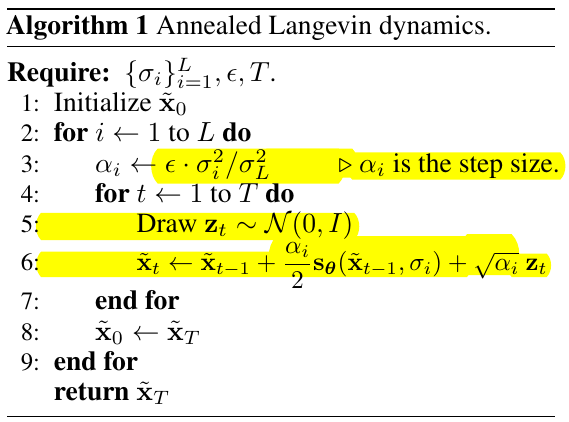

The network can be applied to both generative task and inpainting task. The latter one is very similar to __Repaint__.

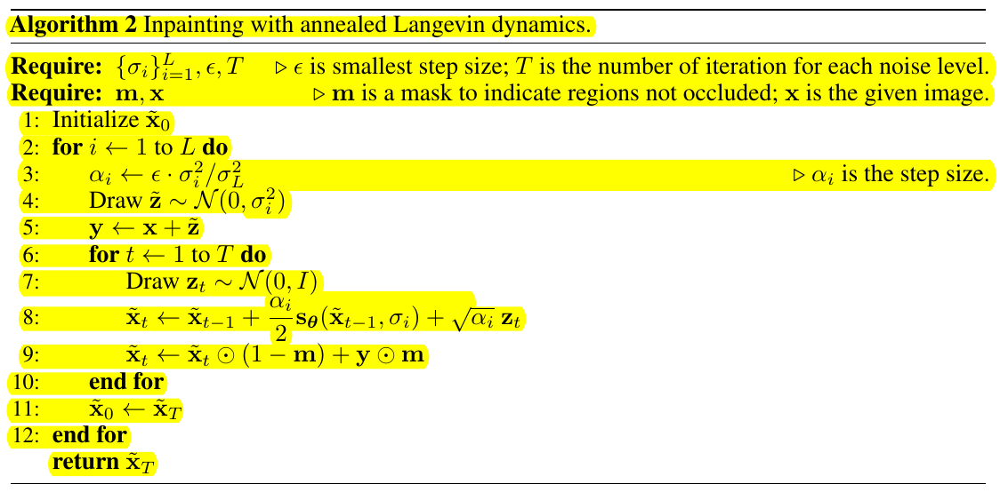

## DDPM

1. Basic theory and proof
2. Training and inferencing

A better version of score-based model with a weighted variational bound as its objective.

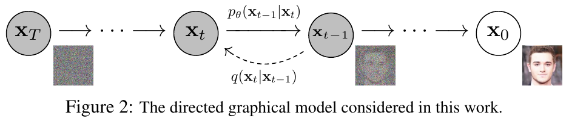

1. Basic theory and proof

* Diffusion process:

Diffusion process, or forward process, is fixed to a Markov chain that gradually adds Gaussian noise to the data according to a variance schedule $\beta_1,\dots,\beta_T$.

We write the data distribution we want to sample from as:

$$x_0 \textasciitilde q(x_0).$$

And the diffusion process can then be written as:

$$q(x_{1:T}|x_0) = \Pi_{t=1}^T q(x_t|x_{t-1}),$$

$$q(x_t|x_{t-1}) = \mathcal{N}(x_t;\mu_\theta(x_t,t),\Sigma_\theta(x_t,t)).$$

* Reverse process:

Reverse process is what we really want to build. It is defined as a Markov chain with learned Gaussian transitions starting at:

$$p(x_T) = \mathcal{N}(x_T;0,I).$$

We hope we will gradually recover the data $x_0$ by reversing the diffusion process, and we also model the transition function as a Guassian distribution:

$$p_\theta(x_{0:T}) = p(x_T)\Pi_{t=1}^T p_\theta(x_{t-1}|x_t),$$

$$p_\theta(x_{t-1}|x_t) = \mathcal{N}(x_{t-1};\mu_\theta(x_t,t),\Sigma_\theta(x_t,t)).$$

We need to learn the parameters of the guassian distribution.

* Objective:

It is very important to provide an objective for model to learn at the beginning. Intuitively, we want to maximize:

$$\mathbb{E}_{x_0 \textasciitilde q(x_0)}\left[\log p_\theta(x_0)\right].$$

That is, we want to maximize the expectation of probability of $x_0$ to be produced from $p_\theta(x)$, where $x_0$ is sampled from the real world data distribution $q(x_0)$. For the ease of gradient decent, we rewrite it to minimize the objective:

$$\mathbb{E}_{x_0 \textasciitilde q(x_0)}\left[-\log p_\theta(x_0)\right].$$

However, we can not directly optimize this objective since we have no idea what $p_\theta(x_0)$ is. So instead, our approach is to apply variational bound to it, i.e. to find an upper bound for it and minimize its upper bound. If the upper bound can be minimized, the objective can also be minimized.

Let's first observe this objective. Notice that it has a form of $-\log$ inside the expectation, and it is a convex function. So naturally, this remind us of the Jensen's inequality:

$$\mathbb{E}[f(X)] \ge f(\mathbb{E}[X]),$$

where $f(x)$ is a convex function, $X$ is a random variable. The inequality reverses when the function is concave. And we can prove the following non-negativity of KL-divergence:

$$D_{KL}(p\|q) \ge 0.$$

Proof:

$$D_{KL}(p\|q) = \mathbb{E}_{x \textasciitilde p(x)}[\log \frac{p(x)}{q(x)}],$$

$$=\mathbb{E}_{x \textasciitilde p(x)}[-\log \frac{q(x)}{p(x)}],$$

$$\ge -\log(\mathbb{E}_{x \textasciitilde p(x)}[\frac{q(x)}{p(x)}]),$$

$$= -\log\left[\int q(x) dx\right] = -\log 1 = 0.$$

Thus, we may write:

$$D_{KL}(q(x_{1:T}|x_0)\|p_\theta(x_{1:T}|x_0)) \ge 0,$$

which can be rewrite as:

$$\mathbb{E}_{x_{1:T} \textasciitilde q(x_{1:T}|x_0)}[\log \frac{q(x_{1:T}|x_0)}{p_\theta(x_{1:T}|x_0)}] \ge 0,$$

$$\mathbb{E}_{x_{1:T} \textasciitilde q(x_{1:T}|x_0)}[-\log \frac{p_\theta(x_{1:T}|x_0)}{q(x_{1:T}|x_0)}] \ge 0,$$

$$\mathbb{E}_{x_{1:T} \textasciitilde q(x_{1:T}|x_0)}[-\log \frac{p_\theta(x_{0:T})}{p_\theta(x_0)q(x_{1:T}|x_0)}] \ge 0,$$

$$\mathbb{E}_{x_{1:T} \textasciitilde q(x_{1:T}|x_0)}[-\log p_\theta(x_0)] \le \mathbb{E}_{x_{1:T} \textasciitilde q(x_{1:T}|x_0)}[-\log \frac{p_\theta(x_{0:T})}{q(x_{1:T}|x_0)}].$$

So we can easily find a upper bound for the objective:

$$\mathbb{E}_{x_0 \textasciitilde q(x_0)}\left[-\log p_\theta(x_0)\right] = \mathbb{E}_{x_0 \textasciitilde q(x_0)}\mathbb{E}_{x_{1:T} \textasciitilde q(x_{1:T}|x_0)}\left[-\log p_\theta(x_0)\right],$$

$$=\mathbb{E}_{x_0 \textasciitilde q(x_0)}\mathbb{E}_{x_{1:T} \textasciitilde q(x_{1:T}|x_0)}\left[-\log p_\theta(x_0)\right],$$

$$\le \mathbb{E}_{x_0 \textasciitilde q(x_0)}\mathbb{E}_{x_{1:T} \textasciitilde q(x_{1:T}|x_0)}\left[-\log \frac{p_\theta(x_{0:T})}{q(x_{1:T}|x_0)}\right],$$

$$= \mathbb{E}_{x_0 \textasciitilde q(x_0)}\mathbb{E}_{x_{1:T} \textasciitilde q(x_{1:T}|x_0)}\left[-\log p_\theta(x_T) -\log \frac{p_\theta(x_{0:T-1}|x_T)}{q(x_{1:T}|x_0)}\right],$$

$$= \mathbb{E}_{x_0 \textasciitilde q(x_0)}\mathbb{E}_{x_{1:T} \textasciitilde q(x_{1:T}|x_0)}\left[-\log p_\theta(x_T) -\log \frac{\Pi_{t=1}^T p_\theta(x_{t-1}|x_t)}{\Pi_{t=1}^Tq(x_{t}|x_{t-1})}\right],$$

$$= \mathbb{E}_{x_0 \textasciitilde q(x_0)}\mathbb{E}_{x_{1:T} \textasciitilde q(x_{1:T}|x_0)}\left[-\log p_\theta(x_T) -\Sigma_{t=1}^T\log \frac{p_\theta(x_{t-1}|x_t)}{q(x_{t}|x_{t-1})}\right].$$

So we use this upper bound as our objective instead for optimization:

$$L = \mathbb{E}_{x_0 \textasciitilde q(x_0)}\mathbb{E}_{x_{1:T} \textasciitilde q(x_{1:T}|x_0)}\left[-\log p_\theta(x_T) -\Sigma_{t=1}^T\log \frac{p_\theta(x_{t-1}|x_t)}{q(x_{t}|x_{t-1})}\right].$$

:hammer::wrench:

# Paper Daily: 2D Editing Methods

## InstructPix2Pix

1. Generating a multi-modal training dataset
2. InstructPix2Pix training and inference

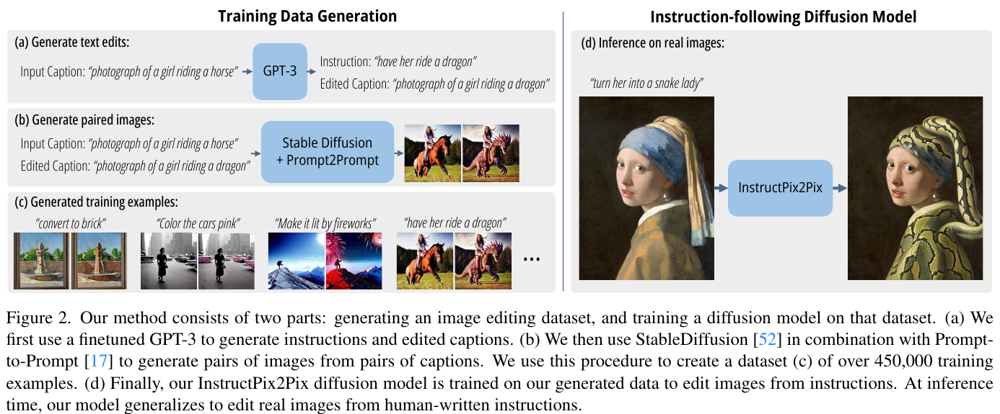

1. Generating a multi-modal training dataset

* Dataset:

$$(I_o, I_e, c_T),$$

where $I_o$ represents the original image, $I_e$ represents the edited image, $c_T$ represents the text condition.

* Generating instructions and paired captions:

We first operate entirely in the text domain, where we leverage a large language model to take in image captions and produce editing instructions and the resulting text captions after the edit.

Our model is trained by finetuning GPT-3 on a relatively small human-written dataset of editing triplets: (1) input captions, (2) edit instructions, (3) output captions.

To produce the fine-tuning dataset, we sampled 700 input captions from the LAION-Aesthetics V2 6.5+ dataset and manually wrote instructions and output captions.

Using this data, we fine-tuned the GPT-3 Davinci model for a single epoch using the default training parameters.

Our final corpus of generated instructions and captions consists of 454, 445 examples.

* Generating paired Images from paired captions:

Next, we use a pretrained text-to-image model to transform a pair of captions (referring to the image before and after the edit) into a pair of images.

We therefore use __Prompt-to-Prompt__, a recent method aimed at encouraging multiple generations from a text-to-image diffusion model to be similar. This is done through borrowed cross attention weights in some number of denoising steps. 

For instance, changes of larger magnitude, such as those which change large-scale image structure (e.g., moving objects around, replacing with objects of
different shapes), may require less similarity in the generated image pair. Fortunately, Prompt-to-Prompt has as a parameter that can control the similarity between the two images: the fraction of denoising steps p with shared attention weights. Unfortunately, identifying an optimal value of p from only the captions and edit text is difficult. We therefore generate 100 sample pairs of images per caption-pair, each with a random p \~ U(0.1, 0.9), and filter these samples by using a CLIP-based metric: the directional similarity in CLIP space. Performing this filtering not only helps maximize the diversity and quality of our image pairs, but also makes our data generation more robust to failures of Prompt-to-Prompt and Stable Diffusion.

2. InstructPix2Pix training and inference

* Training objective:

$$L = \mathbb{E}_{\mathcal{E}(x),\mathcal{E}(c_I),c_T,\epsilon\textasciitilde
\mathcal{N}(0,1),t}\left[\|\epsilon-\epsilon_\theta(z_t,t,\mathcal{E}(c_I),c_T)\|_2^2\right],$$

where $\mathcal{E}$ is the image encoder, $z_t$ is $z=\mathcal{E}(x)$ adding noise to $t$ step. $c_I$ is the image condition and $c_T$ is the text condition.

* Network structure:

We initialize the weights of our model with a pretrained Stable Diffusion checkpoint. To support image conditioning, we add additional input channels
to the first convolutional layer, concatenating $z_t$ and $\mathcal{E}(c_I)$.
All available weights of the diffusion model are initialized from the pretrained checkpoints, and weights that operate on the newly added input channels are initialized to zero. We reuse the same text conditioning mechanism that was originally intended for captions to instead take as input the text edit instruction $c_T$.

* Training details:

Can be found in the appendix of original paper.

* Classifier-free guidance for two conditionings:

Classifier-free guidance effectively shifts probability mass toward data where an implicit classifier $p_\theta(c|z_t)$ assigns high likelihood to the conditioning $c$. Training for unconditional denoising is done by simply setting the conditioning to a fixed null value $c = \emptyset$ at some frequency during training.

For our task, the score network $e_\theta (z_t,c_I,c_T)$ has two conditionings: the input image $c_I$ and text instruction $c_T$. We find if beneficial to leverage classifier-free guidance with respect to both conditionings.During training, we randomly set only $c_I = \emptyset_I$ for 5% of examples, only $c_T = \emptyset_T$ for 5% of examples, and both $c_I = \emptyset_I$ and $c_T = \emptyset_T$ for 5% of examples. Our model is therefore capable of conditional or unconditional denoising with respect to both or either conditional inputs. We introduce two guidance scales, $s_I$ and $s_T$, which can be adjusted to trade off how strongly the generated samples correspond with the input image and how strongly they correspond with the edit instruction.

We have:

$$\widetilde{e}_\theta (z_t,c_I,c_T) = e_\theta (z_t,\emptyset,\emptyset)+S_I \cdot(e_\theta (z_t,c_I,\emptyset)-e_\theta (z_t,\emptyset,\emptyset)) +S_T \cdot(e_\theta (z_t,c_I,c_T)-e_\theta (z_t,c_I,\emptyset)). $$

Proof:

Our generative model learns $P(z|c_I,c_T)$, the probability distribution of image latents $z=\mathcal{E}(x)$ conditioned on an input image $c_I$ and a text instruction $c_T$. We arrive at our particular classifier-free guidance formulation by expressing the conditional probability as follows:

$$P(z|c_I,c_T)=\frac{P(z,c_I,c_T)}{P(c_I,c_T)}=\frac{P(c_I,c_T|z)P(z)}{P(c_I,c_T)}=\frac{P(c_T|c_I,z)P(c_I|z)P(z)}{P(c_I,c_T)}.$$

Taking the logarithm and then the derivative gives us the following expression:

$$\nabla_z\log P(c_T|c_I,z) + \nabla_z\log P(c_I|z) + \nabla_z\log P(z),$$

which corresponds to our equation. 

Note: it is said that such sequence in $c_I$ and $c_T$ can acheive better performance.

# Paper Daily: 2D-lifted-3D Guidances with 3D Priors

## Zero-1-to-3

1. Learning to control camera viewpoint
2. View-conditional diffusion
3. Coordinate System

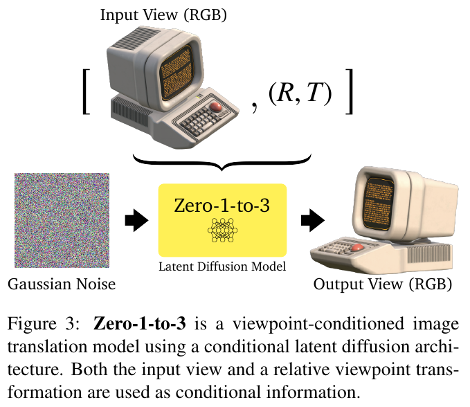

1. Learning to control camera viewpoint

* Dataset:

$$\{(x,x_{(R,T)},R,T),\}$$

where $x$ is a single RGB image, $R\in\mathbb{R}^{3 \times 3}$ is the relative rotation, $T\in\mathbb{R}^3$ is the relative translation, $x_{(R,T)}$ is the novel view after transform from $x$.

* Training objective:

$$\mathbb{E}_{z\textasciitilde\mathcal{E}(x),t,\epsilon\textasciitilde\mathcal{N}(0,1)}\left[\epsilon-\epsilon_\theta(z_t,t,c(x,R,T))\right]_2^2,$$

where $z_t$ is $z=\mathcal{E}(x)$ adding noise to timestep $t$, $\mathcal{E}$ is the image encoder.

2. View-conditional diffusion

We adopt a hybrid conditioning mechanism. On one stream, a CLIP embedding of the input image is concatenated with $(R,T)$ to form a “posed CLIP” embedding
$c(x,R,T)$. We apply cross-attention to condition the denoising U-Net, which provides high-level semantic information of the input image. On the other stream, the input image is channel-concatenated with the image being denoised, assisting the model in keeping the identity and details of the object being synthesized. To be able to apply classifier-free guidance, we follow a similar mechanism proposed in __InstructPix2Pix__, setting the input image and the posed CLIP embedding to a null vector randomly, and scaling the conditional information during inference.

We use the rendered dataset to finetune a pretrained Stable Diffusion model for performing novel view synthesis. Since the original Stable Diffusion network is not conditioned on multimodal text embeddings, the original Stable Diffusion architecture needs to be tweaked and finetuned to be able to take conditional information from an image. This is done in __Stable diffusion image variations(a hugging face space) by lambdalabs__, and we use their released checkpoints. To further adapt the model to accept conditional information from an image along with a relative camera pose, we concatenate the image CLIP embedding (dimension 768) and the pose vector (dimension 4) and initialize another fully-connected layer ($772 \to 768$) to ensure compatibility with the diffusion model architecture. The learning rate of this layer is scaled up to be $10\times$ larger than the other layers. The rest of the network architecture is kept the same as the original Stable Diffusion.

3. Coordinate system

* polar angle, azimuth angle, radius:

$$(\theta, \phi, r).$$

* normalization:

$$[-0.5,0.5]^3.$$

* sample view-points range:

$$\theta \in [0,\pi], \phi \in [0,2\pi], r \in [1.5,2.2]$$

* horizontal view of camera:

$$49.1\degree.$$

* View encoding:

$$(\theta, \sin(\phi), \cos(\phi), r).$$

The reason we do this encode is because the incontinuity of the azimuth angle. The view of $1\degree$ may be very close to that of $359\degree$, but they are very different in azimuth value. But after we hard code it with $\sin(\phi)$ and $\cos(\phi)$, they will achieve better continuity since they will be close to each other in encoding space.

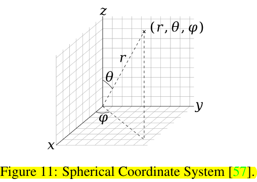

## MVDream

## SweetDreamer

# Paper Daily: 2D-lifted-3D Applications with 3D Priors 

## DreamCraft3D

1. Geometry Alignment with generated/provided image
2. Score Distillation Sampling(SDS) from a combination of 3D prior model and T2I model
3. Bootstrapped Score Distillation(BSD) to specifically boost the texture.

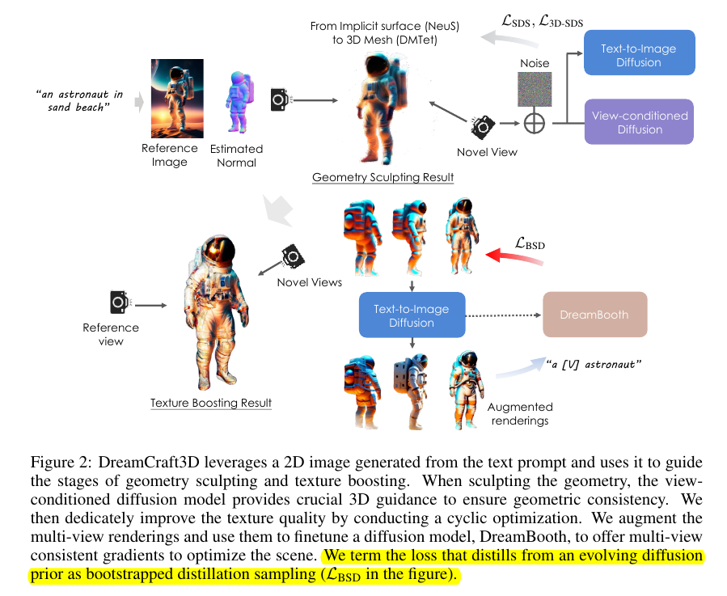 

1. Geometry Alignment

* RGB Loss:

$$\mathcal{L}_{RGB} = \|\hat{m} \odot (\hat{x}-g(\theta;\hat{c}))\|_2, $$

where $\hat{m}$ is the mask, $\hat{x}$ is the reference image, $\hat{c}$ is the corresponding camera pose.

* Mask Loss:

$$\mathcal{L}_{mask} = \|\hat{m} - g_m(\theta;\hat{c})\|_2,$$

where $g_m$ renders the silhouette.

* Depth Loss:

$$\mathcal{L}_{depth} = -\frac{conv(d,\hat{d})}{\sigma(d)\sigma(\hat{d})},$$

where $\hat{d}$ is the depth prediction from a off-the-shelf single-view estimator.

* Normal Loss:

$$\mathcal{L}_{normal} = -\frac{n \cdot \hat{n}}{\|n\|_2 \cdot \|\hat{n}\|_2},$$

where $\hat{n}$ is the normal prediction from a off-the-shelf single-view estimator.

2. SDS

* SDS on T2I model:

$$ \nabla_{\theta}\mathcal{L}_{SDS}(\phi,g(\theta)) = \mathbb{E}_{t,\epsilon}\left[ \omega(t)(\epsilon_\phi(x_t;y,t)-\epsilon)\frac{\partial x}{\partial \theta}\right], $$ 

where $\epsilon_\phi$ comes from T2I model: DeepFloyd IF based model, which operates on 64*64 pixel space.

* SDS on 3D prior model:

$$ \nabla_{\theta}\mathcal{L}_{3D-SDS}(\phi,g(\theta)) = \mathbb{E}_{t,\epsilon}\left[ \omega(t)(\epsilon_\phi(x_t;\hat{x},c,y,t)-\epsilon)\frac{\partial x}{\partial \theta}\right], $$ 

where $\epsilon_\phi$ comes from 3D prior model: Zero123.

* Hybrid SDS Loss:

$$\nabla_{\theta}\mathcal{L}_{hybrid}(\phi,g(\theta))=\nabla_{\theta}\mathcal{L}_{SDS}(\phi,g(\theta)) + \mu\nabla_{\theta}\mathcal{L}_{3D-SDS}(\phi,g(\theta)),$$

where $\mu = 2$. 

* Progressive view training: progressively enlarge the training views, gradually propagating the well-established geometry to $360\degree$ results.

* Diffusion timestep annealing: sampling larger diffusion timestep t from the range [0.7, 0.85] when computing $\nabla_{\theta}\mathcal{L}_{hybrid}(\phi,g(\theta))$ to provide the global structure, then linearly annealing
the t sampling range to [0.2, 0.5] over hundreds of iterations to refine
the structural details.

* 3D representation: NeuS in coarse stage, DMTeT in fine stage.

3. BSD

* Variational Score Distillation(VSD):

$$\mathcal{L}_{VSD} = D_{KL}(q^\mu(x_0|y)||p(x_0|y)),$$

$$\nabla_{\theta}\mathcal{L}_{VSD}(\phi,g(\theta)) = \mathbb{E}_{t,\epsilon}\left[ \omega(t)(\epsilon_\phi(x_t;y,t)-\epsilon_{lora}(x_t;y,t,c))\frac{\partial x}{\partial \theta}\right],$$

where $\epsilon_{lora}$ estimates the score of the rendered images using a LoRA (Low-rank adaptation).

* DreamBooth for fine-tuning using the multi-view rendered images:

$$ x_r = r_{t'}(x), $$

where $x_r$ stands for an augmented image renderings.

$$ x_{t'} = \alpha_{t'}x_0 + \sigma_{t'}\epsilon,$$

By choosing a large $t'$ , these augmented images reveal high-frequency details at the cost of the fidelity to the original renderings.

During finetuning, the camera parameter of each view is introduced as an additional condition. 

Initially, the 3D mesh yields blurry multi-view renderings. We adopt a large diffusion $t'$ to augment their texture quality while introducing some 3D inconsistency. The DreamBooth model trained on these augmented renderings obtains a unified 3D concept of the scene to guide texture refinement. As the 3D mesh reveals finer textures, we reduce the diffusion noises introduced to the image renderings, so the DreamBooth model learns from more consistent renderings and better captures the image distribution faithful to evolving views. In this cyclic process, the 3D mesh and diffusion prior mutually improve in a bootstrapped manner. 

* BSD Loss:

$$\nabla_{\theta}\mathcal{L}_{BSD}(\phi,g(\theta)) = \mathbb{E}_{t,\epsilon, c}\left[ \omega(t)(\epsilon_{DreamBooth}(x_t;y,t,r_{t'}(x),c)-\epsilon_{lora}(x_t;y,t,c))\frac{\partial x}{\partial \theta}\right],$$

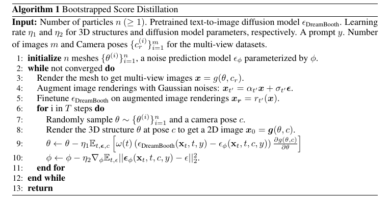 

## Wonder3D

## SyncDreamer

## One-2-3-45

## Magic123

## Consistent123