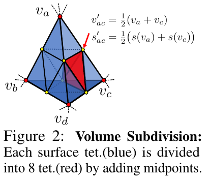

# Paper Daily: 3D Representation

## DMTeT

1. Deformable Tetrahedral Grid(DTG)
2. Volume Subdivision(VS)
3. Marching Tetrahedra(MT)
4. Neural Network(NN) Structure

1. DTG

* Deformable Tetrahedral Grid: 

$$ (V_T,T). $$

* Tetrahedra:

$$ T_k = \{v_{ak}, v_{bk}, v_{ck}, v_{dk}\}, T_k \in T, k\in\{1,2,...,K\},v_{ik}\in V_T.$$ 

* SDF value stored on vertices:

$$ s(v_i), v_i \in V_T. $$

* SDF value else where: $s(v)$ follows a barycentric interpolation.

2. VS

* Determine the surface tetrahedra $T_{surf}$: checking whether there are vertices in different SDF signs.

* Subdivide $T_{surf}$ for higher resolution:

$$v_{ac} = \frac{1}{2}(v_a+v_c),$$
$$s(v_{ac)} = \frac{1}{2}(s(v_a)+s(v_c)).$$

3. MT

* Define typology inside each grid depending on the signs of SDF values on its vertices.

* Determine locations of vertices: $s(v) = 0$

$$ v_{ab} = \frac{v_a \cdot s(v_b) - v_b \cdot s(v_a)}{s(v_b) - s(v_a)}.$$

4. NN Structure

* $v_i, \alpha_i$ are all learnable parameters

## 3D Gaussian Splatting

# Paper Daily: Score-based Generative Models

## SMLD

1. Score Matching for score estimation
2. Sampling with Langevin dynamics

Score matching with Langevin dynamics.

Suppose our datset consists of i.i.d. samples $\{x_i \in \mathbb{R}^D\}_{i=1}^N$ from an unknown data distribution $p_{data}(x)$. 

1. Score Matching for score estimation

* Score of a probability density $p(x)$ :

$$\nabla_x \log p(x).$$

* Score network to approximate the score of $p_{data}(x)$:

$$s_\theta: \mathbb{R}^D \to \mathbb{R}^D.$$

* Minimize objective:

$$\frac{1}{2}\mathbb{E}_{p_{data}(x)}\left[\|s_\theta(x)-\nabla_x\log p_{data}(x)\|_2^2\right]$$

$$\Leftrightarrow$$

$$\mathbb{E}_{p_{data}(x)}\left[tr(\nabla_xs_\theta(x)) + \frac{1}{2}\|s_\theta(x)\|_2^2\right]+const,$$

under $s_\theta{x}$ is differentiable, $p_{data}(x)$ is differentiable, $\mathbb{E}\left[\|s_\theta(x)\|^2 \right]$ and $\mathbb{E}\left[\|\nabla_x\log p_{data}(x)\|^2 \right]$ are finite for any $\theta$, $p_{data}(x)s_\theta(x)$ goes to 0 for any $\theta$ when $\|x\| \to \infty$,where $\nabla_xs_\theta(x)$ denotes the Jacobian of $s_\theta(x)$.

Proof:

First, rewrite the original objective as:

$$J(\theta) = \int p_{data}(x) \left[\frac{1}{2}\|\nabla_x\log p_{data}(x)\|^2 + \frac{1}{2}\|s_\theta(x)\|^2 - \nabla_x\log p_{data}(x)^T s_\theta(x)\right]dx,$$

where we can ignore the $\frac{1}{2}\|\nabla_x\log p_{data}(x)\|^2$ part since it is unrelated with $\theta$ and it will be a constant. The integral of $\frac{1}{2}\|s_\theta(x)\|^2$ is exactly equal to $\mathbb{E}_{p_{data}(x)}\left[\frac{1}{2}\|s_\theta(x)\|^2\right]$. So all we need to prove is:

$$\int p_{data}(x) \left[- \nabla_x\log p_{data}(x)^T s_\theta(x)\right]dx = \int p_{data}(x) \left[tr(\nabla_xs_\theta(x))\right]dx,$$

i.e,

$$\int p_{data}(x) \left[- \nabla_x\log p_{data}(x)^T s_\theta(x)\right]dx = \int p_{data}(x) \left[\Sigma_{i=1}^N \frac{\partial s_\theta(x)_i}{\partial x_i}\right]dx.$$

To further prove this part, we first examine:

$$\int p_{data}(x) \left[- \nabla_x\log p_{data}(x)^T s_\theta(x)\right]dx = -\Sigma_{i=1}^N \int p_{data}(x) \nabla_{x_i}\log p_{data}(x) s_\theta(x)_i dx,$$

where we consider each $i$ seperately applying chain rule:

$$-\int p_{data}(x) \frac{\partial\log p_{data}(x)}{\partial x_i} s_\theta(x)_i dx = -\int p_{data}(x)\frac{1}{p_{data}(x)}\frac{\partial p_{data}(x)}{\partial x_i} s_\theta(x)_i dx, $$

$$= -\int \frac{\partial p_{data}(x)}{\partial x_i} s_\theta(x)_i dx.$$

To further prove the equation, we would like to introduce the lemma below:

$$\lim_{a \to \infty, b \to -\infty} f(a,x_2,\dots,x_n)g(a,x_2,\dots,x_n) - f(b,x_2,\dots,x_n)g(b,x_2,\dots,x_n),$$

$$=\int_{-\infty}^{\infty} f(x)\frac{\partial g(x)}{\partial x_1}dx_1 + \int_{-\infty}^{\infty} g(x)\frac{\partial f(x)}{\partial x_1}dx_1,$$

which is obvious when you regard $x_1$ as the only variable of the functions and other variables remain fixed. The only thing you need to do is to integrate over $x_1 \in \mathbb{R}$:

$$\frac{\partial f(x)g(x)}{\partial x_1} = f(x)\frac{\partial g(x)}{\partial x_1} + g(x)\frac{\partial f(x)}{\partial x_1}.$$

With this lemma, we can rewrite $-\int \frac{\partial p_{data}(x)}{\partial x_1} s_\theta(x)_1 dx$ as:

$$-\int \frac{\partial p_{data}(x)}{\partial x_1} s_\theta(x)_1 dx = -\int \left[ \int \frac{\partial p_{data}(x)}{\partial x_1} s_\theta(x)_1 dx_1 \right] d(x_2,\dots,x_n),$$

$$= -\int \left[\lim_{a \to \infty, b \to -\infty}\left[ p_{data}(a,x_2,\dots,x_n)s_\theta(a,x_2,\dots,x_n)_1 - p_{data}(b,x_2,\dots,x_n)s_\theta(b,x_2,\dots,x_n)_1\right]\right]$$

$$d(x_2,\dots,x_n)$$

$$+\int\int \frac{\partial s_\theta(x)_1}{\partial x_1} p_{data}(x) dx_1 d(x_2,\dots,x_n).$$

Since we assume that $p_{data}(x)s_\theta(x)$ goes to 0 for any $\theta$ when $\|x\| \to \infty$, then:

$$-\int \frac{\partial p_{data}(x)}{\partial x_1} s_\theta(x)_1 dx = \int \frac{\partial s_\theta(x)_1}{\partial x_1} p_{data}(x) dx,$$

and we finished the proof.

However, score matching is expensive since we need to compute and backpropagate $tr(\nabla_xs_\theta(x))$, where $x$ is a high-dimensional data.

* Denoising score matching:

Denoising score matching is a variant of score matching that
completely circumvents $tr(\nabla_xs_\theta(x))$.

Recall the minimize objective:

$$\frac{1}{2}\mathbb{E}_{p_{data}(x)}\left[\|s_\theta(x)-\nabla_x\log p_{data}(x)\|_2^2\right].$$

The problem is, we can not acquire an explicit representation of $p_{data}(x)$. To fix this, we may use a Parzen windows density estimator $q_{\sigma}(\widetilde{x})$.

The Parzen window density estimator is a non-parametric method used for estimating the probability density function (PDF) of a random variable. It is particularly useful when the underlying distribution is not known or when the data is limited. The Parzen window approach is based on the idea of placing a window (or kernel) around each data point and using these windows to estimate the overall density.

Here's a brief overview of how the Parzen window density estimator works(in 1D case):

First it needs to choose a window/kernel function. A kernel function should be symmetric and integrate to one. A general example is a Gaussian kernel:

$$K(u) = \frac{1}{\sqrt{2\pi}}\exp\{-\frac{1}{2}u^2\}.$$

For each data point $x_i$​, a window is centered at that point. The choice of the window width, often denoted as $h$ (bandwidth), determines the smoothness of the estimated density. A larger bandwidth results in a smoother estimate, but it might oversmooth the density and lose fine details. Conversely, a smaller bandwidth captures more details but may be sensitive to noise.

The density estimate $q_{\sigma}(\widetilde{x})$ at a point $\widetilde{x}$ is obtained by summing up the contributions of all data points, each scaled by the kernel function and the window width $\sigma$:

$$q_{\sigma}(\widetilde{x})=\frac{1}{n\sigma}\Sigma_{i=1}^n  K(\frac{\widetilde{x}-x_i}{\sigma}).$$

The Parzen window estimator is sensitive to the choice of the kernel function and bandwidth. Cross-validation or other methods can be used to select an optimal bandwidth for a given dataset.

While the Parzen window estimator is simple and intuitive, it may not perform well in high-dimensional spaces due to the "curse of dimensionality." Other techniques like kernel density estimation with different bandwidth selection methods or more advanced density estimation methods (e.g., mixture models) might be considered for such cases.

So we replace $p_{data}(x)$ with $q_{\sigma}(\widetilde{x})$ in the objective above.

In this case, we get a new objective along with its equivalent form:

$$\frac{1}{2}\mathbb{E}_{q_{\sigma}(\widetilde{x})}\left[\|s_\theta(\widetilde{x})-\nabla_\widetilde{x}\log q_{\sigma}(\widetilde{x})\|_2^2\right]$$

$$\Leftrightarrow$$

$$\frac{1}{2}\mathbb{E}_{q_{\sigma}(\widetilde{x}|x)p_{data}(x)}\left[\|s_\theta(\widetilde{x})-\nabla_\widetilde{x}\log q_{\sigma}(\widetilde{x}|x)\|_2^2\right],$$

where the perturbed data distribution $q_{\sigma}(\widetilde{x})=\int q_{\sigma}(\widetilde{x}|x) p_{data}(x)dx$.

Proof:

First we rewrite the objective as:

$$\frac{1}{2}\mathbb{E}_{q_{\sigma}(\widetilde{x})}\left[\|s_\theta(\widetilde{x})-\nabla_\widetilde{x}\log q_{\sigma}(\widetilde{x})\|_2^2\right],$$

$$=\frac{1}{2}\int(\|s_\theta(\widetilde{x})-\nabla_\widetilde{x}\log q_{\sigma}(\widetilde{x})\|_2^2)q_{\sigma}(\widetilde{x})d\widetilde{x},$$

$$=\frac{1}{2}\int(\|s_\theta(\widetilde{x})\|_2^2 + \|\nabla_\widetilde{x}\log q_{\sigma}(\widetilde{x})\|_2^2)q_{\sigma}(\widetilde{x})d\widetilde{x} -\int\langle s_\theta(\widetilde{x}), \nabla_\widetilde{x}\log q_{\sigma}(\widetilde{x})\rangle q_{\sigma}(\widetilde{x})d\widetilde{x}.$$

Take a closer examine to the last term:

$$\int\langle s_\theta(\widetilde{x}), \nabla_\widetilde{x}\log q_{\sigma}(\widetilde{x})\rangle q_{\sigma}(\widetilde{x})d\widetilde{x},$$

$$=\int\langle s_\theta(\widetilde{x}), \frac{1}{q_{\sigma}(\widetilde{x})}\nabla_\widetilde{x}q_{\sigma}(\widetilde{x})\rangle q_{\sigma}(\widetilde{x})d\widetilde{x},$$

$$=\int\langle s_\theta(\widetilde{x}), \nabla_\widetilde{x}q_{\sigma}(\widetilde{x})\rangle d\widetilde{x},$$

$$=\int\langle s_\theta(\widetilde{x}), \nabla_\widetilde{x}\int q_{\sigma}(\widetilde{x}|x) p_{data}(x)dx\rangle d\widetilde{x},$$

$$=\int\langle s_\theta(\widetilde{x}), \int \nabla_\widetilde{x}q_{\sigma}(\widetilde{x}|x) p_{data}(x)dx\rangle d\widetilde{x},$$

$$=\int\int\langle s_\theta(\widetilde{x}), \nabla_\widetilde{x}q_{\sigma}(\widetilde{x}|x) p_{data}(x)\rangle dxd\widetilde{x},$$

$$=\int\int\langle s_\theta(\widetilde{x}), q_{\sigma}(\widetilde{x}|x)\nabla_\widetilde{x}\log q_{\sigma}(\widetilde{x}|x) p_{data}(x)\rangle dxd\widetilde{x},$$

$$=\int\int\langle s_\theta(\widetilde{x}), \nabla_\widetilde{x}\log q_{\sigma}(\widetilde{x}|x) \rangle q_{\sigma}(\widetilde{x}|x)p_{data}(x)dxd\widetilde{x}.$$

Then, we put this term back to the objective:

$$=\frac{1}{2}\int(\|s_\theta(\widetilde{x})\|_2^2 + \|\nabla_\widetilde{x}\log q_{\sigma}(\widetilde{x})\|_2^2)q_{\sigma}(\widetilde{x})d\widetilde{x} -\int\langle s_\theta(\widetilde{x}), \nabla_\widetilde{x}\log q_{\sigma}(\widetilde{x})\rangle q_{\sigma}(\widetilde{x})d\widetilde{x},$$

$$=\frac{1}{2}\int\int(\|s_\theta(\widetilde{x})\|_2^2 + \|\nabla_\widetilde{x}\log q_{\sigma}(\widetilde{x})\|_2^2)q_{\sigma}(\widetilde{x}|x)p_{data}(x)dxd\widetilde{x}$$

$$-\int\int\langle s_\theta(\widetilde{x}), \nabla_\widetilde{x}\log q_{\sigma}(\widetilde{x}|x) \rangle q_{\sigma}(\widetilde{x}|x)p_{data}(x)dxd\widetilde{x},$$

$$=\frac{1}{2}\mathbb{E}_{q_{\sigma}(\widetilde{x}|x)p_{data}(x)}\left[\|s_\theta(\widetilde{x})-\nabla_\widetilde{x}\log q_{\sigma}(\widetilde{x}|x)\|_2^2\right].$$

And we finished the prove.

However, although $s_{\theta^*}(\widetilde{x})=\nabla_\widetilde{x}\log q_{\sigma}(\widetilde{x})$ (where ${\theta^*}=argmin_{\theta}(\frac{1}{2}\mathbb{E}_{q_{\sigma}(\widetilde{x}|x)p_{data}(x)}\left[\|s_\theta(\widetilde{x})-\nabla_\widetilde{x}\log q_{\sigma}(\widetilde{x}|x)\|_2^2\right])$) almost  surely, $\sigma$ has to be small enough to make the approximation $p_{data}(x)\approx q_{\sigma}(\widetilde{x})$ come true. Thus making it impossible to directly sample from a simple distribution like standard gaussian(if $\sigma$ can be large enough, $q_{\sigma}(\widetilde{x})$ will approximate to some simple distribution like gaussian).

:hammer: :wrench:

* Sliced score matching:

Sliced score matching uses random projections to approximate
$tr(\nabla_{\theta}s_{\theta}(x))$ in score matching. 

:hammer: :wrench:

2. Sampling with Langevin dynamics

:hammer: :wrench:

## DDPM

# Paper Daily: 2D Editing Methods

## InstructPix2Pix

1. Generating a multi-modal training dataset
2. InstructPix2Pix training and inference

1. Generating a multi-modal training dataset

* Dataset:

$$(I_o, I_e, c_T),$$

where $I_o$ represents the original image, $I_e$ represents the edited image, $c_T$ represents the text condition.

* Generating instructions and paired captions:

We first operate entirely in the text domain, where we leverage a large language model to take in image captions and produce editing instructions and the resulting text captions after the edit.

Our model is trained by finetuning GPT-3 on a relatively small human-written dataset of editing triplets: (1) input captions, (2) edit instructions, (3) output captions.

To produce the fine-tuning dataset, we sampled 700 input captions from the LAION-Aesthetics V2 6.5+ dataset and manually wrote instructions and output captions.

Using this data, we fine-tuned the GPT-3 Davinci model for a single epoch using the default training parameters.

Our final corpus of generated instructions and captions consists of 454, 445 examples.

* Generating paired Images from paired captions:

Next, we use a pretrained text-to-image model to transform a pair of captions (referring to the image before and after the edit) into a pair of images.

We therefore use Prompt-to-Prompt, a recent method aimed at encouraging multiple generations from a text-to-image diffusion model to be similar. This is done through borrowed cross attention weights in some number of denoising steps. 

For instance, changes of larger magnitude, such as those which change large-scale image structure (e.g., moving objects around, replacing with objects of
different shapes), may require less similarity in the generated image pair. Fortunately, Prompt-to-Prompt has as a parameter that can control the similarity between the two images: the fraction of denoising steps p with shared attention weights. Unfortunately, identifying an optimal value of p from only the captions and edit text is difficult. We therefore generate 100 sample pairs of images per caption-pair, each with a random p \~ U(0.1, 0.9), and filter these samples by using a CLIP-based metric: the directional similarity in CLIP space. Performing this filtering not only helps maximize the diversity and quality of our image pairs, but also makes our data generation more robust to failures of Prompt-to-Prompt and Stable Diffusion.

2. InstructPix2Pix training and inference

* Training objective:

$$L = \mathbb{E}_{\mathcal{E}(x),\mathcal{E}(c_I),c_T,\epsilon\textasciitilde
\mathcal{N}(0,1),t}\left[\|\epsilon-\epsilon_\theta(z_t,t,\mathcal{E}(c_I),c_T)\|_2^2\right],$$

where $\mathcal{E}$ is the image encoder, $z_t$ is $z=\mathcal{E}(x)$ adding noise to $t$ step. $c_I$ is the image condition and $c_T$ is the text condition.

* Network structure:

We initialize the weights of our model with a pretrained Stable Diffusion checkpoint. To support image conditioning, we add additional input channels
to the first convolutional layer, concatenating $z_t$ and $\mathcal{E}(c_I)$.
All available weights of the diffusion model are initialized from the pretrained checkpoints, and weights that operate on the newly added input channels are initialized to zero. We reuse the same text conditioning mechanism that was
originally intended for captions to instead take as input the text edit instruction $c_T$.

* Training details:

Can be found in the appendix of original paper.

* Classifier-free guidance for two conditionings:

Classifier-free guidance effectively shifts probability mass toward data where an implicit classifier $p_\theta(c|z_t)$ assigns high likelihood to the conditioning $c$. Training for unconditional denoising is done by simply setting the conditioning to a fixed null value $c = \emptyset$ at some frequency during training.

For our task, the score network $e_\theta (z_t,c_I,c_T)$ has two conditionings: the input image $c_I$ and text instruction $c_T$. We find if beneficial to leverage classifier-free guidance with respect to both conditionings.During training, we randomly set only $c_I = \emptyset_I$ for 5% of examples, only $c_T = \emptyset_T$ for 5% of examples, and both $c_I = \emptyset_I$ and $c_T = \emptyset_T$ for 5% of examples. Our model is therefore capable of conditional or unconditional denoising with respect to both or either conditional inputs. We introduce two guidance scales, $s_I$ and $s_T$, which can be adjusted to trade off how strongly the generated samples correspond with the input image and how strongly they correspond with the edit instruction.

We have:

$$\widetilde{e}_\theta (z_t,c_I,c_T) = e_\theta (z_t,\emptyset,\emptyset)+S_I \cdot(e_\theta (z_t,c_I,\emptyset)-e_\theta (z_t,\emptyset,\emptyset)) +S_T \cdot(e_\theta (z_t,c_I,c_T)-e_\theta (z_t,c_I,\emptyset)). $$

Proof:

Our generative model learns $P(z|c_I,c_T)$, the probability distribution of image latents $z=\mathcal{E}(x)$ conditioned on an input image $c_I$ and a text instruction $c_T$. We arrive at our particular classifier-free guidance formulation by expressing the conditional probability as follows:

$$P(z|c_I,c_T)=\frac{P(z,c_I,c_T)}{P(c_I,c_T)}=\frac{P(c_I,c_T|z)P(z)}{P(c_I,c_T)}=\frac{P(c_T|c_I,z)P(c_I|z)P(z)}{P(c_I,c_T)}.$$

Taking the logarithm and then the derivative gives us the following expression:

$$\nabla_z\log P(c_T|c_I,z) + \nabla_z\log P(c_I|z) + \nabla_z\log P(z),$$

which corresponds to our equation. 

Note: it is said that such sequence in $c_I$ and $c_T$ can acheive better performance.

# Paper Daily: 2D-lifted-3D Guidances with 3D Priors

## Zero-1-to-3

1. Learning to control camera viewpoint
2. View-conditional diffusion
3. Coordinate System

1. Learning to control camera viewpoint

* Dataset:

$$\{(x,x_{(R,T)},R,T),\}$$

where $x$ is a single RGB image, $R\in\mathbb{R}^{3 \times 3}$ is the relative rotation, $T\in\mathbb{R}^3$ is the relative translation, $x_{(R,T)}$ is the novel view after transform from $x$.

* Training objective:

$$\mathbb{E}_{z\textasciitilde\mathcal{E}(x),t,\epsilon\textasciitilde\mathcal{N}(0,1)}\left[\epsilon-\epsilon_\theta(z_t,t,c(x,R,T))\right]_2^2,$$

where $z_t$ is $z=\mathcal{E}(x)$ adding noise to timestep $t$, $\mathcal{E}$ is the image encoder.

2. View-conditional diffusion

We adopt a hybrid conditioning mechanism. On one stream, a CLIP embedding of the input image is concatenated with $(R,T)$ to form a “posed CLIP” embedding
$c(x,R,T)$. We apply cross-attention to condition the denoising U-Net, which provides high-level semantic information of the input image. On the other stream, the input image is channel-concatenated with the image being denoised, assisting the model in keeping the identity and details of the object being synthesized. To be able to apply classifier-free guidance, we follow a similar mechanism proposed in __InstructPix2Pix__, setting the input image and the posed CLIP embedding to a null vector randomly, and scaling the conditional information during inference.

We use the rendered dataset to finetune a pretrained Stable Diffusion model for performing novel view synthesis. Since the original Stable Diffusion network is not conditioned on multimodal text embeddings, the original Stable Diffusion architecture needs to be tweaked and finetuned to be able to take conditional information from an image. This is done in __Stable diffusion image variations(a hugging face space) by lambdalabs__, and we use their released checkpoints. To further adapt the model to accept conditional information from an image along with a relative camera pose, we concatenate the image CLIP embedding (dimension 768) and the pose vector (dimension 4) and initialize another fully-connected layer ($772 \to 768$) to ensure compatibility with the diffusion model architecture. The learning rate of this layer is scaled up to be $10\times$ larger than the other layers. The rest of the network architecture is kept the same as the original Stable Diffusion.

3. Coordinate system

* polar angle, azimuth angle, radius:

$$(\theta, \phi, r).$$

* normalization:

$$[-0.5,0.5]^3.$$

* sample view-points range:

$$\theta \in [0,\pi], \phi \in [0,2\pi], r \in [1.5,2.2]$$

* horizontal view of camera:

$$49.1\degree.$$

* View encoding:

$$(\theta, \sin(\phi), \cos(\phi), r).$$

The reason we do this encode is because the incontinuity of the azimuth angle. The view of $1\degree$ may be very close to that of $359\degree$, but they are very different in azimuth value. But after we hard code it with $\sin(\phi)$ and $\cos(\phi)$, they will achieve better continuity since they will be close to each other in encoding space.

## MVDream

## SweetDreamer

# Paper Daily: 2D-lifted-3D Applications with 3D Priors 

## DreamCraft3D

1. Geometry Alignment with generated/provided image
2. Score Distillation Sampling(SDS) from a combination of 3D prior model and T2I model
3. Bootstrapped Score Distillation(BSD) to specifically boost the texture.

 

1. Geometry Alignment

* RGB Loss:

$$\mathcal{L}_{RGB} = \|\hat{m} \odot (\hat{x}-g(\theta;\hat{c}))\|_2, $$

where $\hat{m}$ is the mask, $\hat{x}$ is the reference image, $\hat{c}$ is the corresponding camera pose.

* Mask Loss:

$$\mathcal{L}_{mask} = \|\hat{m} - g_m(\theta;\hat{c})\|_2,$$

where $g_m$ renders the silhouette.

* Depth Loss:

$$\mathcal{L}_{depth} = -\frac{conv(d,\hat{d})}{\sigma(d)\sigma(\hat{d})},$$

where $\hat{d}$ is the depth prediction from a off-the-shelf single-view estimator.

* Normal Loss:

$$\mathcal{L}_{normal} = -\frac{n \cdot \hat{n}}{\|n\|_2 \cdot \|\hat{n}\|_2},$$

where $\hat{n}$ is the normal prediction from a off-the-shelf single-view estimator.

2. SDS

* SDS on T2I model:

$$ \nabla_{\theta}\mathcal{L}_{SDS}(\phi,g(\theta)) = \mathbb{E}_{t,\epsilon}\left[ \omega(t)(\epsilon_\phi(x_t;y,t)-\epsilon)\frac{\partial x}{\partial \theta}\right], $$ 

where $\epsilon_\phi$ comes from T2I model: DeepFloyd IF based model, which operates on 64*64 pixel space.

* SDS on 3D prior model:

$$ \nabla_{\theta}\mathcal{L}_{3D-SDS}(\phi,g(\theta)) = \mathbb{E}_{t,\epsilon}\left[ \omega(t)(\epsilon_\phi(x_t;\hat{x},c,y,t)-\epsilon)\frac{\partial x}{\partial \theta}\right], $$ 

where $\epsilon_\phi$ comes from 3D prior model: Zero123.

* Hybrid SDS Loss:

$$\nabla_{\theta}\mathcal{L}_{hybrid}(\phi,g(\theta))=\nabla_{\theta}\mathcal{L}_{SDS}(\phi,g(\theta)) + \mu\nabla_{\theta}\mathcal{L}_{3D-SDS}(\phi,g(\theta)),$$

where $\mu = 2$. 

* Progressive view training: progressively enlarge the training views, gradually propagating the well-established geometry to $360\degree$ results.

* Diffusion timestep annealing: sampling larger diffusion timestep t from the range [0.7, 0.85] when computing $\nabla_{\theta}\mathcal{L}_{hybrid}(\phi,g(\theta))$ to provide the global structure, then linearly annealing
the t sampling range to [0.2, 0.5] over hundreds of iterations to refine
the structural details.

* 3D representation: NeuS in coarse stage, DMTeT in fine stage.

3. BSD

* Variational Score Distillation(VSD):

$$\mathcal{L}_{VSD} = D_{KL}(q^\mu(x_0|y)||p(x_0|y)),$$

$$\nabla_{\theta}\mathcal{L}_{VSD}(\phi,g(\theta)) = \mathbb{E}_{t,\epsilon}\left[ \omega(t)(\epsilon_\phi(x_t;y,t)-\epsilon_{lora}(x_t;y,t,c))\frac{\partial x}{\partial \theta}\right],$$

where $\epsilon_{lora}$ estimates the score of the rendered images using a LoRA (Low-rank adaptation).

* DreamBooth for fine-tuning using the multi-view rendered images:

$$ x_r = r_{t'}(x), $$

where $x_r$ stands for an augmented image renderings.

$$ x_{t'} = \alpha_{t'}x_0 + \sigma_{t'}\epsilon,$$

By choosing a large $t'$ , these augmented images reveal high-frequency details at the cost of the fidelity to the original renderings.

During finetuning, the camera parameter of each view is introduced as an additional condition. 

Initially, the 3D mesh yields blurry multi-view renderings. We adopt a large diffusion $t'$ to augment their texture quality while introducing some 3D inconsistency. The DreamBooth model trained on these augmented renderings obtains a unified 3D concept of the scene to guide texture refinement. As the 3D mesh reveals finer textures, we reduce the diffusion noises introduced to the image renderings, so the DreamBooth model learns from more consistent renderings and better captures the image distribution faithful to evolving views. In this cyclic process, the 3D mesh and diffusion prior mutually improve in a bootstrapped manner. 

* BSD Loss:

$$\nabla_{\theta}\mathcal{L}_{BSD}(\phi,g(\theta)) = \mathbb{E}_{t,\epsilon, c}\left[ \omega(t)(\epsilon_{DreamBooth}(x_t;y,t,r_{t'}(x),c)-\epsilon_{lora}(x_t;y,t,c))\frac{\partial x}{\partial \theta}\right],$$

 

## Wonder3D

## SyncDreamer

## One-2-3-45

## Magic123

## Consistent123